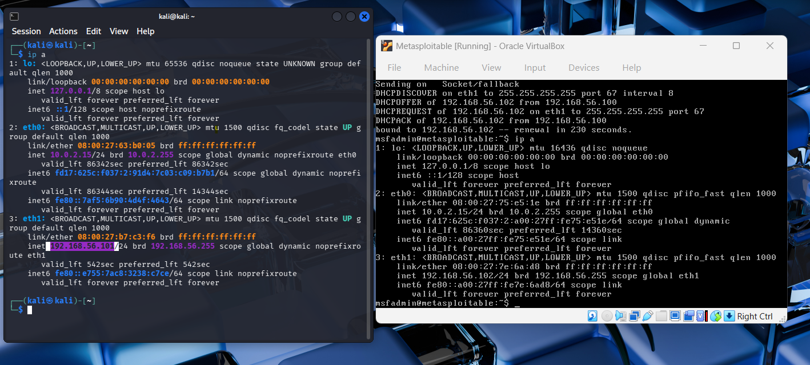
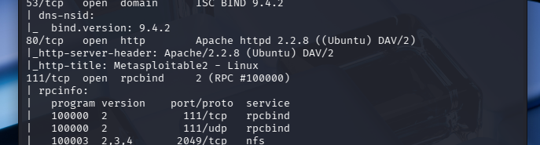
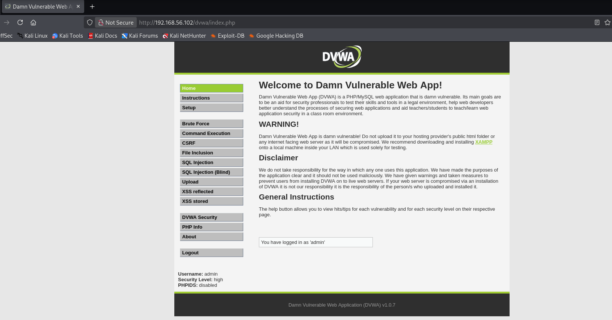
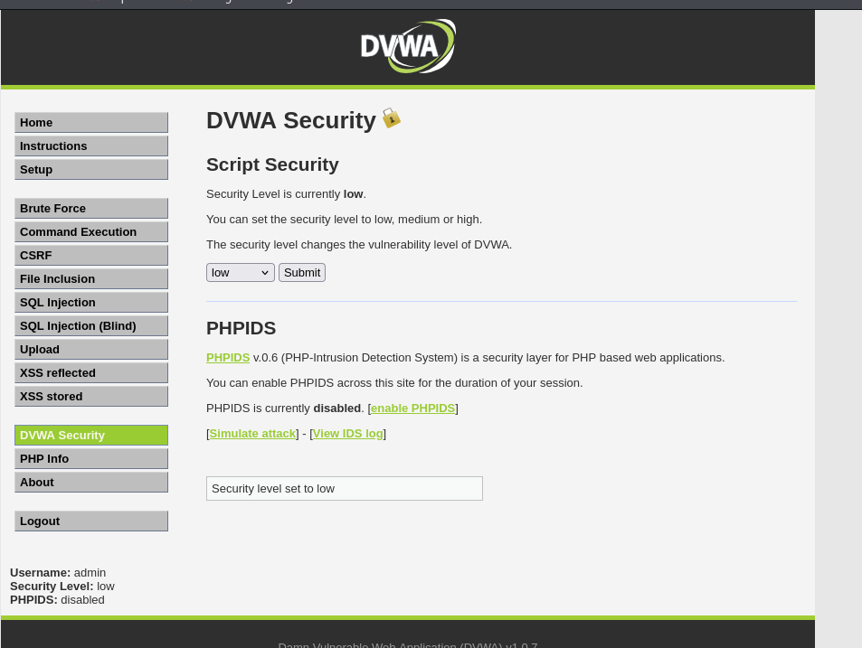
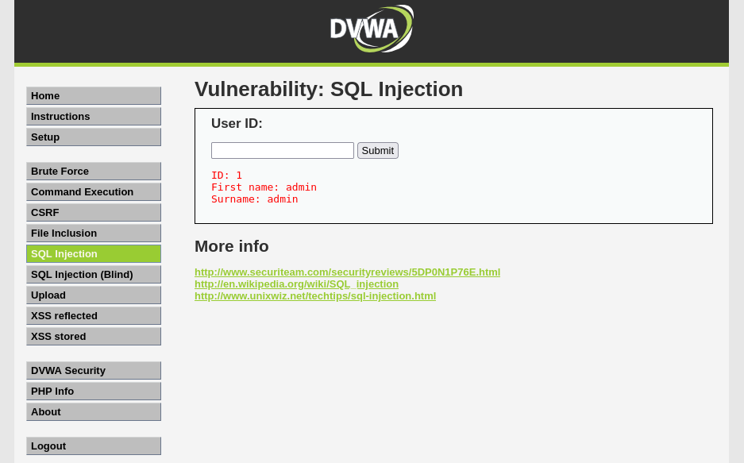
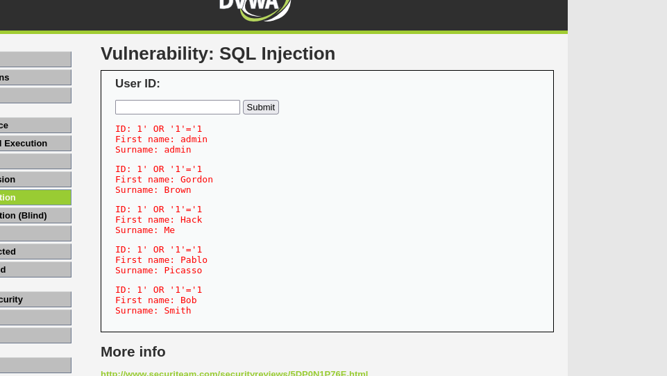

# Web Application Exploitation - SQL Injection (DVWA)

## 📌 Overview
This lab demonstrates how SQL Injection can be used to exploit a vulnerable web application and retrieve unauthorized data from a database.

---

## 🧠 What is SQL Injection?

SQL Injection is a vulnerability that occurs when a website does not properly check user input. This allows an attacker to inject malicious SQL code into a query and manipulate the database.

---

## 🛠️ Lab Setup

- Attacker Machine: Kali Linux      IP:192.168.56.101 
- Target Machine: Metasploitable 2  IP:192.168.56.102
- Vulnerable Application: DVWA (Damn Vulnerable Web Application)  

---

## 🔍 Step 1: Identify Target

The target machine IP address was identified using:

```bash
ip a
```
Target IP:

```
192.168.56.102
```

---

## 🔎 Step 2: Scan for Open Ports

Command used:

```bash
nmap -sV -sC -oN web-scan.txt 192.168.56.102
```
### 🧠 Simple Breakdown

- `nmap` → Tool used to scan a target machine  
- `-sV` → Finds out what services are running and their versions  
- `-sC` → Runs basic scripts to gather extra information automatically  
- `-oN web-scan.txt` → Saves the scan results to a file  
- `192.168.56.102` → The target machine (Metasploitable)
---
### 📸 Output

- Port 80 (HTTP) was found open  
- Apache web server detected  

---

## 🌐 Step 3: Access Web Application

Navigated to:

```
http://192.168.56.102
```

Selected the DVWA application from the webpage.

---

## 🔐 Step 4: Login to DVWA

Credentials used:

```
Username: admin
Password: password
```

---

## ⚙️ Step 5: Set Security Level

- Navigated to **DVWA Security**
- Set security level to:

```
Low
```

---

## 💥 Step 6: SQL Injection Testing

### ✅ Normal Input

```
1
```

- Returned a single user (expected behaviour)

---

### ❌ Malicious Input

```sql
1' OR '1'='1
```

---

## 🎯 Result

- Multiple users were returned instead of one  
- This confirms that the application is vulnerable to SQL Injection  

---

## 🧠 Explanation (Simple)

The application expected a normal user ID such as:

```
1
```

However, the following input was entered:

```sql
' OR '1'='1
```

This changed the SQL query logic.

Since:

```
1 = 1
```

is always true, the database returned all records instead of just one.

---

## 🚨 Impact

This vulnerability could allow an attacker to:

- Retrieve all user data  
- Bypass authentication  
- Access sensitive information  
- Modify or delete database contents  

---

## 🛡️ Mitigation

To prevent SQL Injection:

- Use parameterized queries  
- Validate and sanitize user input  
- Use prepared statements  
- Avoid directly inserting user input into SQL queries  

---

## 📌 Conclusion

This lab demonstrated how improper input validation can lead to SQL Injection vulnerabilities. By exploiting this weakness, it was possible to retrieve unauthorized data from the database.

---

- Security level set to Low  
- Normal query result  
- SQL Injection result showing multiple users  
